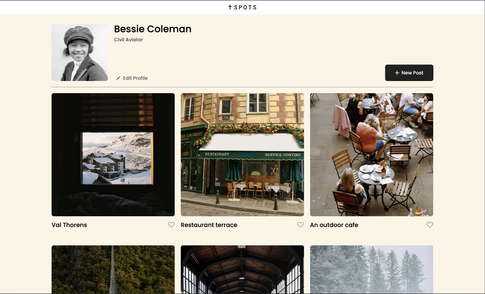
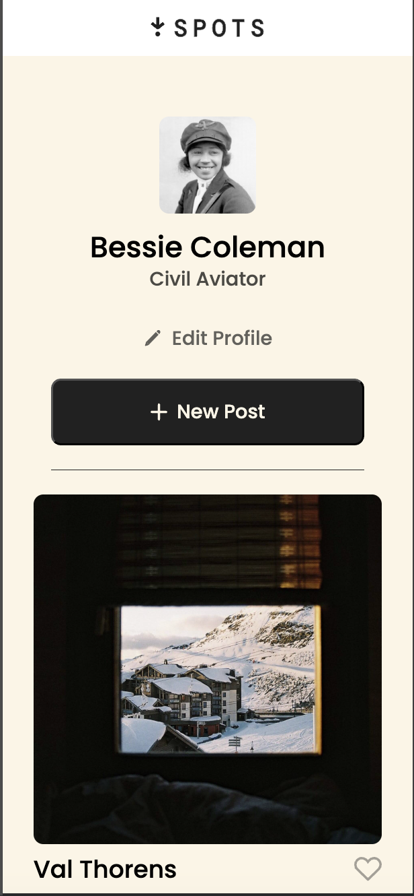

## Project 3: Spots

GIT - https://mikesgitit.github.io/spots

## About

This is a social media web application where users can add photos, like photos from other users, and make adjustments to their profile.

## Functionality

- Display user profile information
- Show a grid of photo cards
- Allow users to like photos
- Provide responsive design for various screen sizes
- Enable profile editing and new post creation

## Technologies and Techniques Used

- HTML5 semantic markup
- CSS3 with Flexbox and Grid layouts
- BEM methodology for CSS organization
- Media queries for responsive design
- CSS custom properties for consistent styling
- Text overflow handling with ellipsis

## Screenshots

### Desktop View

### Mobile View

## Screencast video

